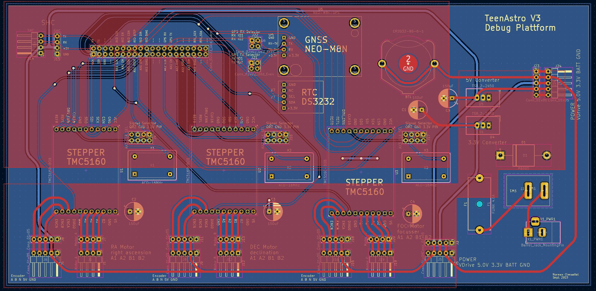
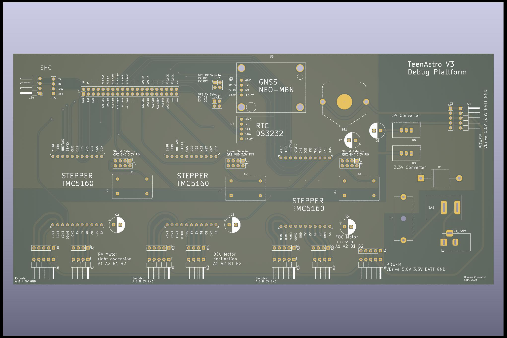
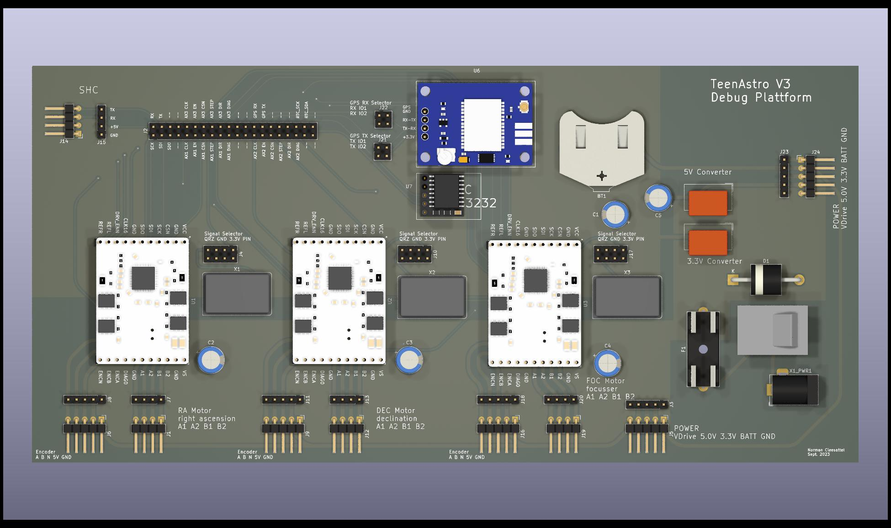
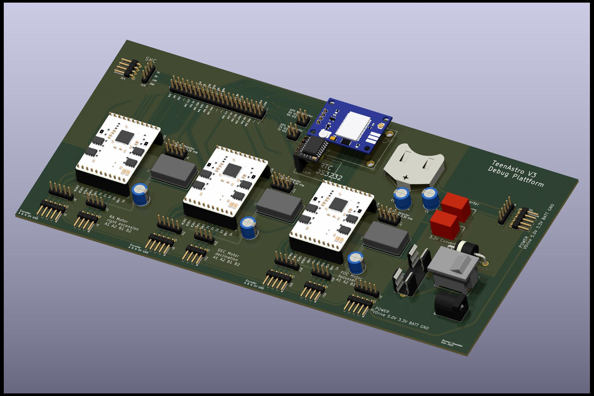
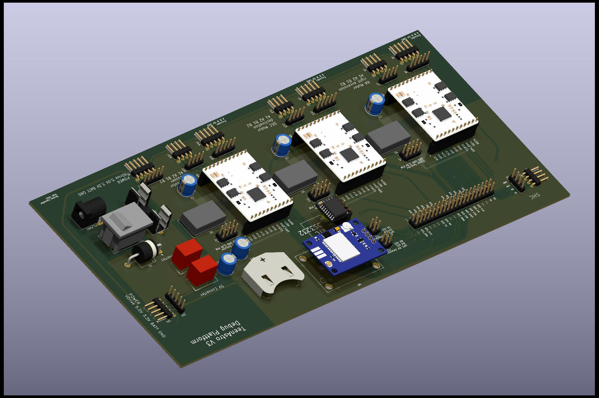
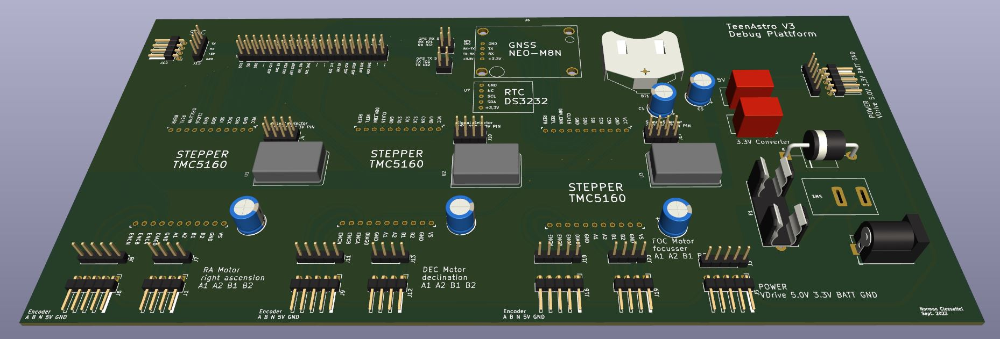

# TA_Debug
PCB designed with KiCad to make a debug main unit for TeenAstro V3 testing.  
I haven't built my own debug platform yet, so I would encourage you to wait for my feedback.  

## internal connectors
The pcb is intended to accommodate:
* TMC5160 for RA, DEC and Focusser
  * the TMC5160 can either be connected via step/dir or SPI 
* 16 MHz oscillators for TMC5160
* NEO-M8n GNSS satellite positioning system
* DS3232 RTC
* power is supplied from a DC jack that splits into
  * VCC for steppers (12 - 24V)
  * 5V for legacy SHC
  * 3.3V for everything else
  * CR32 battery
* power is provided by two Traco DC/DC converters

## external connectors
An MCU like ESP32 or Teensy 4.x can be connected through a ribbon cable to a breadboard.  
There are also connectors for an SHC, stepper motors and encoders.  

## pictures

